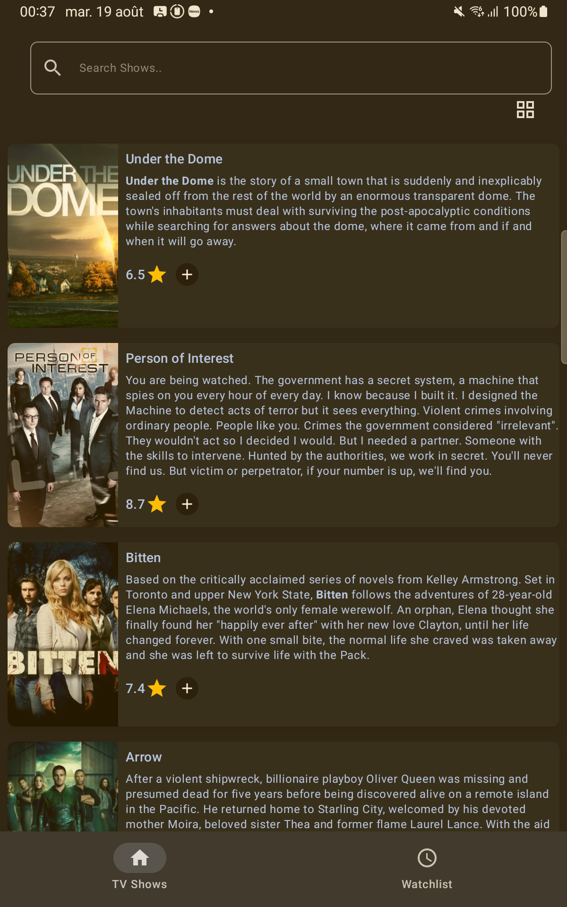

# TVManiak 📺

TVManiak is a Kotlin Multiplatform application for tracking and discovering TV shows across Android, iOS, and Desktop platforms. Built with Compose Multiplatform and following clean architecture principles.

## 🌟 Features

- **TV Show Discovery**: Browse and search through a vast collection of TV shows
- **Advanced Search**: Find shows with intelligent scoring and sorting by relevance
- **Show Details**: View comprehensive information about your favorite shows with high-quality images
- **Watchlist Management**: Add/remove shows to your personal watchlist with reactive updates
- **Shared Transitions**: Smooth animations between screens with Material3 shared element transitions
- **Reactive UI**: Real-time updates across screens using SQLDelight flows
- **Offline Support**: Full offline functionality with intelligent caching
- **Cross-Platform**: Runs on Android, iOS, and Desktop (JVM)

## 📸 Screenshots

### Android
<div align="center">
<table>
<tr>
<td></td>
<td></td>
<td></td>
<td></td>
<td></td>
<td></td>
</tr>
<tr>
<td align="center"><b>TV Shows Grid</b></td>
<td align="center"><b>TV Shows List</b></td>
<td align="center"><b>TV Shows Search</b></td>
<td align="center"><b>Show Details</b></td>
<td align="center"><b>Show Details</b></td>
<td align="center"><b>Watchlist</b></td>
</tr>
</table>
</div>

### iOS
<div align="center">
<table>
<tr>
<td></td>
<td></td>
<td></td>
</tr>
<tr>
<td align="center"><b>TV Shows List</b></td>
<td align="center"><b>TV Shows Grid</b></td>
<td align="center"><b>Watchlist</b></td>
</tr>
</table>
</div>

## 🏗️ Architecture

The project follows a modular clean architecture with clear separation of concerns:

### Module Structure
- **composeApp**: Main application module with platform-specific entry points
- **feature/**: Feature modules containing screens and presentation logic
  - `tvShows`: TV shows listing and search functionality
  - `tvShowDetails`: Show details screen
  - `watchlist`: User's watchlist management
- **core/**: Core modules providing shared functionality
  - `data/`: Data layer with repository implementations, local/remote data sources
  - `domain`: Business logic and use cases
  - `model`: Data models and entities
  - `common`: Shared utilities and extensions
  - `designsystem`: Shared UI components and theming

### Tech Stack
- **UI**: Compose Multiplatform with Material3 design and shared element transitions
- **Architecture**: Clean Architecture with MVVM pattern and reactive flows
- **State Management**: Flow-based reactive architecture with Either pattern for error handling
- **DI**: Koin for dependency injection with modular setup
- **Networking**: Ktor for HTTP client with custom interceptors and retry logic
- **Database**: SQLDelight with reactive flows and dual image quality storage
- **Navigation**: Compose Navigation with shared transitions and deep linking
- **Image Loading**: Coil3 with Ktor integration, multi-resolution caching, and quality optimization
- **Testing**: Comprehensive testing with Kotlin Test, coroutines, and fake implementations

## ⚡ Key Architectural Features

### Reactive Architecture
- **Flow-Based State**: All data operations use Kotlin Flow for reactive updates
- **Either Pattern**: Comprehensive error handling with `Either<Error, Success>` pattern
- **Real-Time Updates**: UI automatically updates when data changes (watchlist, search results)

### Smart Image Handling
- **Dual Resolution**: Medium quality for lists/grids, high quality for detail views  
- **Intelligent Caching**: Context-aware cache keys prevent quality conflicts
- **Remote-First Details**: Always attempts to load highest quality data for detail screens

### Optimized Performance
- **Paging**: Efficient data loading with Paging3 integration
- **Coroutine Management**: Proper cancellation handling and structured concurrency
- **Memory Efficiency**: Optimized image loading and data caching strategies

## 🚀 Getting Started

### Prerequisites
- Android Studio (latest version)
- Xcode (for iOS development)
- JDK 11 or higher

### iOS Setup

If you encounter SQLite linking errors on iOS, you may need to manually link libsqlite3:

1. Open your Xcode project
2. Navigate to **Project Settings** > **Build Phases** > **Link Binary with Libraries**
3. Click the "+" button and add `libsqlite3.tbd` to your target

### Development Commands

#### Building
```bash
# Build entire project
./gradlew build

# Assemble Android app
./gradlew assembleDebug
./gradlew assembleRelease

# Build for iOS
./gradlew linkDebugFrameworkIosArm64
```

#### Running
```bash
# Run Android app
./gradlew installDebug

# Run Desktop (JVM) app
./gradlew :composeApp:run

# iOS requires Xcode or running through Android Studio
```

#### Testing
```bash
# Run all tests
./gradlew allTests

# Run platform-specific tests
./gradlew testDebugUnitTest  # Android tests
./gradlew jvmTest           # JVM tests
./gradlew iosX64Test        # iOS tests
```

#### Code Quality
```bash
# Run ktlint checks
./gradlew ktlintCheck

# Auto-format code
./gradlew ktlintFormat

# Run detekt static analysis
./gradlew detekt
```

## 📱 Platform Support

- **Android**: Material3 design with adaptive layouts
- **iOS**: Native iOS integration with SwiftUI compatibility
- **Desktop**: Full-featured desktop experience with keyboard navigation

## 🔧 Development Features

- **Hot Reload**: Fast development with Compose Multiplatform hot reload
- **Modular Architecture**: Easy to maintain and scale with feature-based modules
- **Reactive Data Flow**: SQLDelight flows provide real-time UI updates
- **Smart Caching**: Multi-layered caching strategy with remote-first detail loading
- **Error Handling**: Comprehensive error handling with Either pattern and proper user feedback
- **Image Quality**: Dual resolution image support (medium for lists, high for details)
- **Search Optimization**: Advanced search with scoring, result persistence, and reactive updates
- **Shared Transitions**: Smooth Material3 shared element transitions between screens
- **Type Safety**: Strong typing throughout with sealed classes and data classes

## 📊 Data Sources

- **TVMaze API**: Primary data source for TV show information with comprehensive metadata
- **Local Database**: SQLDelight with reactive flows for offline capabilities and intelligent caching
- **Image CDN**: Multi-resolution image delivery (medium for lists, original for details)
- **Search Index**: Local search capability with relevance scoring and caching

## 🧪 Testing

The project includes comprehensive testing at multiple levels:
- **Unit Tests**: Business logic, use cases, and reactive flows
- **Integration Tests**: Repository and data layer testing with fake implementations
- **Flow Tests**: Reactive data flow and state management testing
- **UI Tests**: Screen and component testing with Compose testing framework
- **Error Handling**: Either pattern and exception handling validation

## 📄 Project Structure

```
TVManiak/
├── composeApp/           # Main application module
├── core/
│   ├── data/            # Data layer (local, remote, repository)
│   ├── domain/          # Business logic and use cases
│   ├── model/           # Data models
│   ├── common/          # Shared utilities
│   └── designsystem/    # UI components and theming
├── feature/
│   ├── tvShows/         # TV shows listing and search
│   ├── tvShowDetails/   # Show details screen
│   └── watchlist/       # Watchlist management
└── build-logic/         # Build configuration and convention plugins
```

## 🤝 Contributing

1. Follow the existing code style and architecture patterns
2. Add tests for new functionality
3. Use the provided Gradle tasks for code quality checks
4. Follow conventional commits for commit messages

## 📚 Learn More

- [Kotlin Multiplatform](https://www.jetbrains.com/help/kotlin-multiplatform-dev/get-started.html)
- [Compose Multiplatform](https://github.com/JetBrains/compose-multiplatform)
- [TVMaze API](https://www.tvmaze.com/api)
