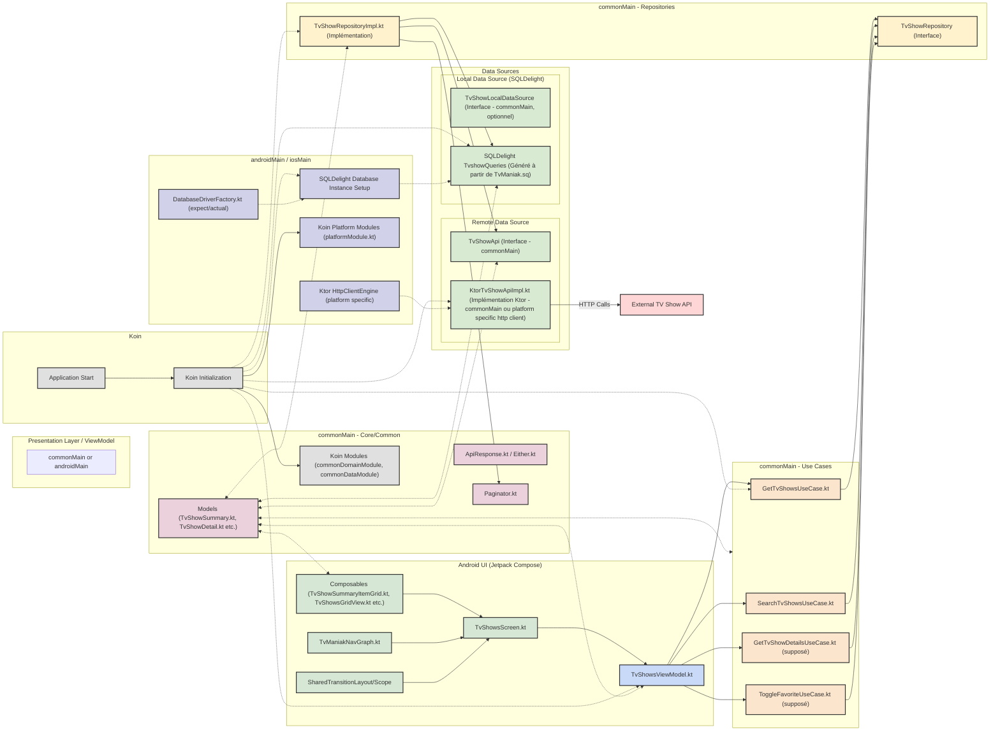

```mermaid
graph LR
    %% UI Layer (Platform Specific - e.g., Android)
    subgraph AndroidUI ["Android UI (Jetpack Compose)"]
        A_Screen[TvShowsScreen.kt] --> A_ViewModel
        A_Composables["Composables (TvShowSummaryItemGrid.kt, TvShowsGridView.kt etc.)"] --> A_Screen
        A_NavGraph[TvManiakNavGraph.kt] --> A_Screen
        SharedTransition["SharedTransitionLayout/Scope"] --> A_Screen
    end

    %% Presentation Layer (ViewModel - Common or Platform Specific)
    subgraph PresentationLayer ["Presentation Layer / ViewModel"]
        direction LR
        subgraph CommonViewModel ["commonMain or androidMain"]
            A_ViewModel[TvShowsViewModel.kt]
        end
    end

    %% Domain Layer (Use Cases - commonMain)
    subgraph DomainLayer ["commonMain - Use Cases"]
        UC_GetTvShows[GetTvShowsUseCase.kt]
        UC_SearchTvShows[SearchTvShowsUseCase.kt]
        UC_GetTvShowDetails["GetTvShowDetailsUseCase.kt (supposé)"]
        UC_ToggleFavorite["ToggleFavoriteUseCase.kt (supposé)"]
    end

    %% Data Layer (Repositories - commonMain)
    subgraph DataLayer ["commonMain - Repositories"]
        Repo["TvShowRepository (Interface)"]
        RepoImpl["TvShowRepositoryImpl.kt (Implémentation)"]
    end

    %% Data Sources (commonMain interfaces, platform-specific implementations)
    subgraph DataSources ["Data Sources"]
        direction LR
        subgraph RemoteDataSource ["Remote Data Source"]
            RDS_Interface["TvShowApi (Interface - commonMain)"]
            RDS_KtorImpl["KtorTvShowApiImpl.kt (Implémentation Ktor - commonMain ou platform specific http client)"]
        end
        subgraph LocalDataSource ["Local Data Source (SQLDelight)"]
            LDS_Interface["TvShowLocalDataSource (Interface - commonMain, optionnel)"]
            LDS_SQLDelight["SQLDelight TvshowQueries (Généré à partir de TvManiak.sq)"]
        end
    end

    %% Common Utilities / Models (commonMain)
    subgraph CommonLibsAndModels ["commonMain - Core/Common"]
        Models["Models (TvShowSummary.kt, TvShowDetail.kt etc.)"]
        ApiResponse["ApiResponse.kt / Either.kt"]
        Paginator[Paginator.kt]
        DI_Modules_Common["Koin Modules (commonDomainModule, commonDataModule)"]
    end

    %% Platform Specific Implementations / Setup
    subgraph PlatformSpecific ["androidMain / iosMain"]
        DriverFactory["DatabaseDriverFactory.kt (expect/actual)"]
        HttpClientEngine["Ktor HttpClientEngine (platform specific)"]
        DI_Modules_Platform["Koin Platform Modules (platformModule.kt)"]
        SQLDelight_DB_Instance["SQLDelight Database Instance Setup"]
    end

    %% Dependencies & Data Flow
    A_ViewModel --> UC_GetTvShows
    A_ViewModel --> UC_SearchTvShows
    A_ViewModel --> UC_GetTvShowDetails
    A_ViewModel --> UC_ToggleFavorite

    UC_GetTvShows --> Repo
    UC_SearchTvShows --> Repo
    UC_GetTvShowDetails --> Repo
    UC_ToggleFavorite --> Repo

    RepoImpl --> RDS_Interface
    RepoImpl --> LDS_SQLDelight
    RepoImpl --> Paginator

    RDS_KtorImpl -->|HTTP Calls| ExternalAPI[External TV Show API]

    %% Koin DI
    subgraph DependencyInjection ["Koin"]
        AppStart["Application Start"] --> KoinInit["Koin Initialization"]
        KoinInit --> DI_Modules_Common
        KoinInit --> DI_Modules_Platform
        KoinInit -.-> A_ViewModel
        KoinInit -.-> UC_GetTvShows
        KoinInit -.-> RepoImpl
        KoinInit -.-> RDS_KtorImpl
        KoinInit -.-> LDS_SQLDelight
        KoinInit -.-> SQLDelight_DB_Instance
    end

    %% Data Models Flow
    Models <-.-> A_Composables
    Models <-.-> A_ViewModel
    Models <-.-> DomainLayer
    Models <-.-> RepoImpl
    Models <-.-> RDS_Interface
    Models <-.-> LDS_SQLDelight


    %% Platform specific setup for common components
    DriverFactory -.-> SQLDelight_DB_Instance
    HttpClientEngine -.-> RDS_KtorImpl
    SQLDelight_DB_Instance -.-> LDS_SQLDelight


    %% Style & Links
    classDef ui fill:#D6E8D5,stroke:#333,stroke-width:2px;
    classDef presentation fill:#C9DAF8,stroke:#333,stroke-width:2px;
    classDef domain fill:#FCE5CD,stroke:#333,stroke-width:2px;
    classDef data fill:#FFF2CC,stroke:#333,stroke-width:2px;
    classDef datasources fill:#D9EAD3,stroke:#333,stroke-width:2px;
    classDef common fill:#EAD1DC,stroke:#333,stroke-width:2px;
    classDef platform fill:#D1D1EA,stroke:#333,stroke-width:2px;
    classDef external fill:#FFD6D6,stroke:#333,stroke-width:2px;
    classDef di fill:#E0E0E0,stroke:#333,stroke-width:2px;

    class A_Screen,A_Composables,A_NavGraph,SharedTransition ui;
    class A_ViewModel presentation;
    class UC_GetTvShows,UC_SearchTvShows,UC_GetTvShowDetails,UC_ToggleFavorite domain;
    class Repo,RepoImpl data;
    class RDS_Interface,RDS_KtorImpl,LDS_Interface,LDS_SQLDelight datasources;
    class ExternalAPI external;
    class Models,ApiResponse,Paginator common;
    class DriverFactory,HttpClientEngine,DI_Modules_Platform,SQLDelight_DB_Instance platform;
    class AppStart,KoinInit,DI_Modules_Common di;
```
